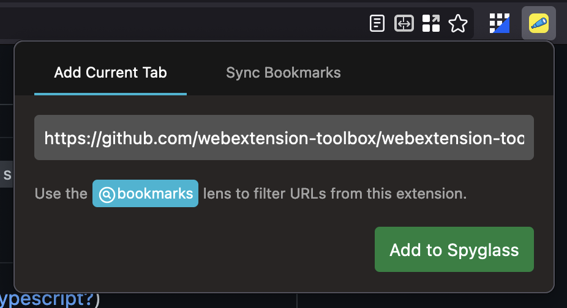

# spyglass-webextension

The Spyglass webextension uses Typescript, React, & the webextension toolbox
to manage cross-browser support from a single codebase.



## Development

Note: The webexension requires an instance of Spyglass running on your machine.

```
npm install
make dev
```
